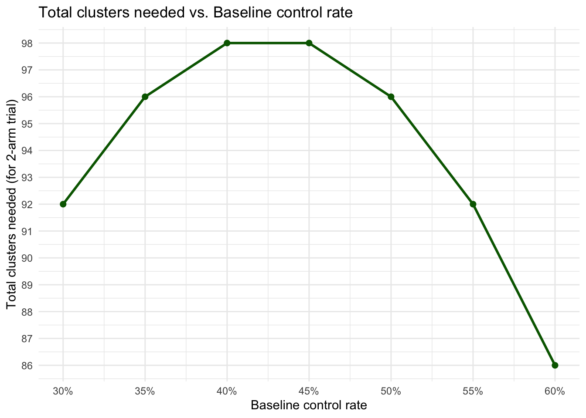
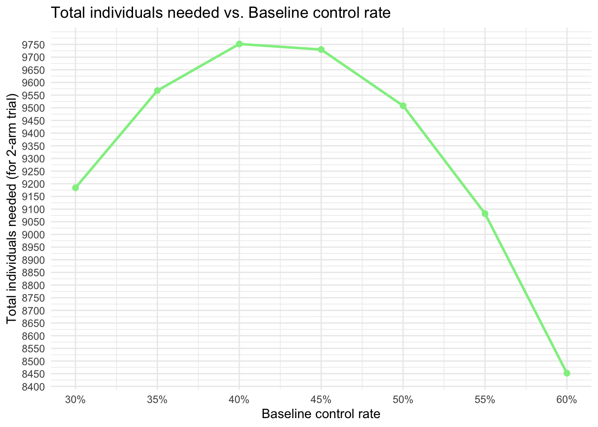
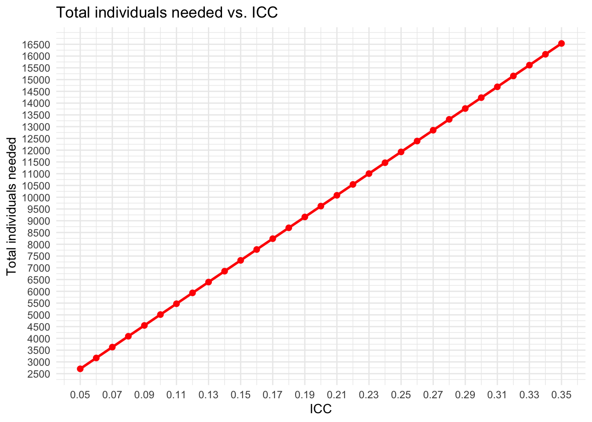
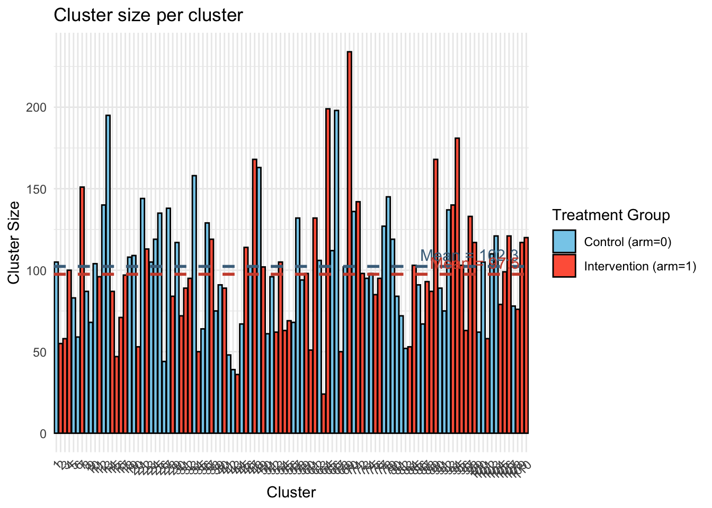
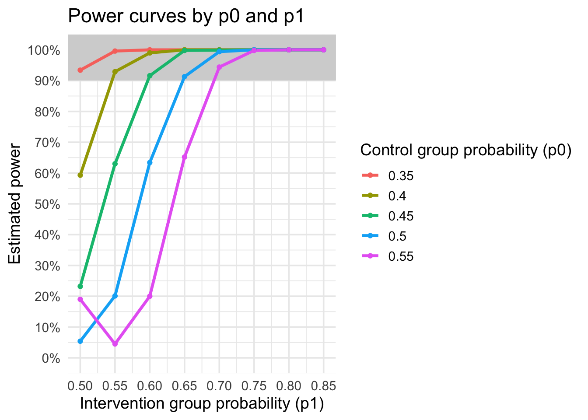
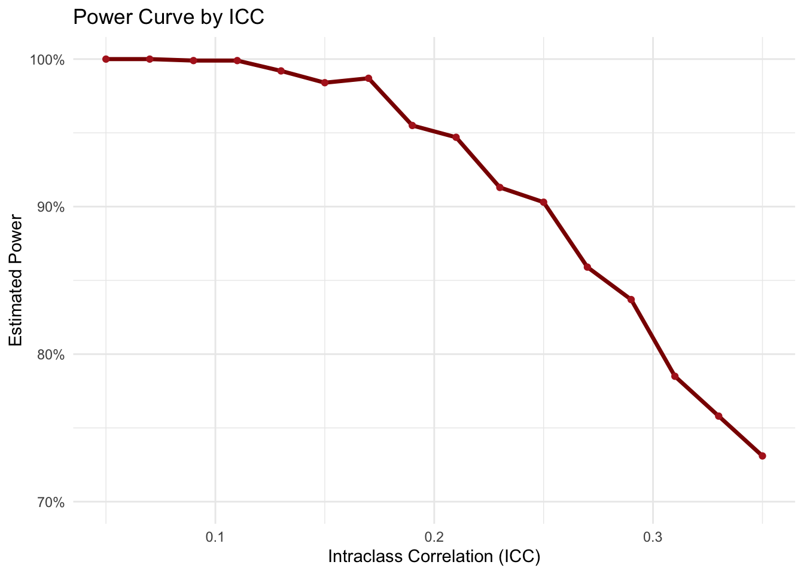
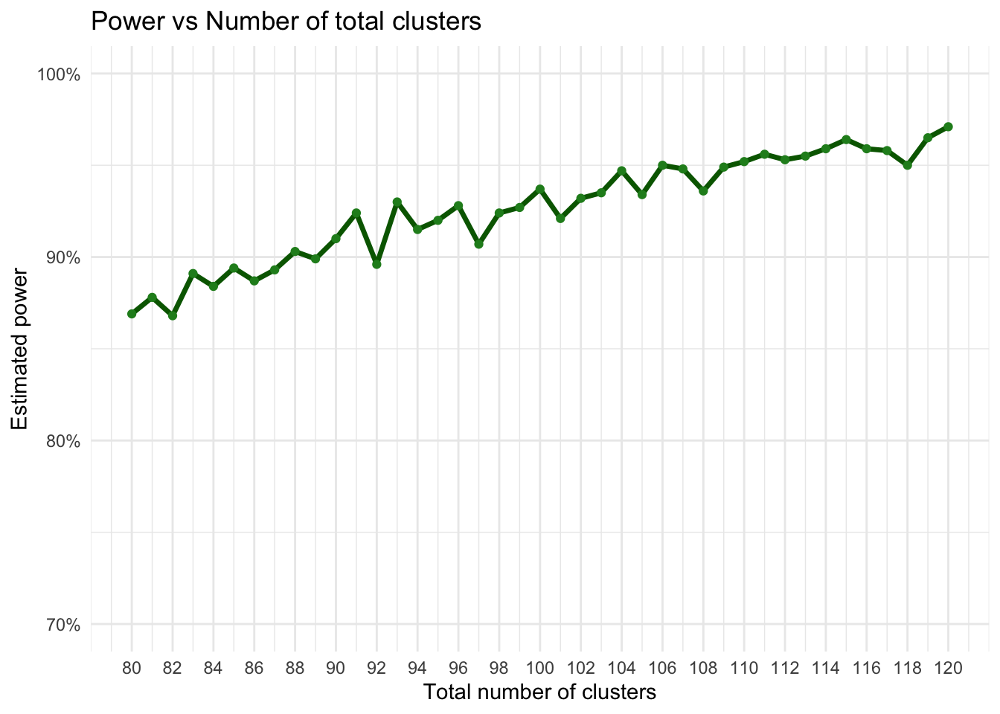
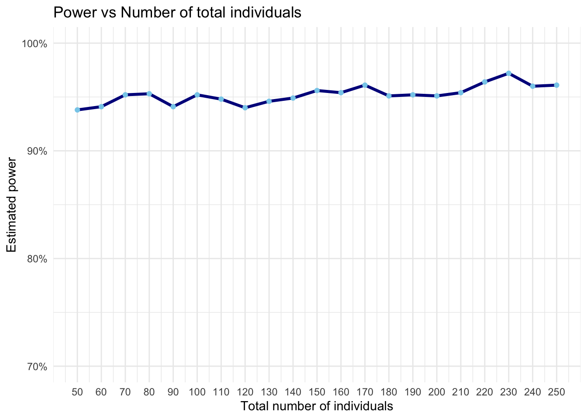

# **STRAT-NUDGE cluster randomized trial (CRT)**

Nuding intervention on the level of SHCS physicians at SHCS sites in Switzerland to promote the use of a novel TB risk score to do individual risk-tailored TB screening (i.e. IGRA testing):

-   **Control**: Enhanced standard of care: Electronic health records (EHR)-based based nudge consisting of a physician-targeted reminder for IGRA testing (no risk score)

-   **Intervention**: EHR-based nudge consisting of a physician-targeted reminder for IGRA testing guided by the risk score (individually risk-tailored: no testing for low-risk, and testing for high-risk))

## **Parameters and design considerations**

-   Two-arm parallel-group, multi-center, superiority, cluster-randomized trial

-   Clusters are SHCS physicians, with their SHCS cohort participants, from all major sites (7 sites across Switzerland)

-   Eligible physician-clusters are active stable SHCS physician and eligible participants are SHCS participants with no recorded IGRA

-   Primary outcome, powered sample size on, is “individually risk-tailored IGRA testing rate”, i.e. testing among high-risk and no testing among low-risk participants (according to the TB score) 

-   Unit of data collection with be the SHCS cohort participants, but level of inference will be the physicians, i.e. cluster-average

-   Binary primary outcome: Proportion of patients successfully risk-tailored screened at first presentation

-   Baseline primary outcome rate (control clusters):

    -   We estimate across the entire cohort that 10% are at high-risk, 90% at low-risk for developing TB (according to score)

    -   The high-risk should be screened, the low-risk should NOT be screened

    -   We estimate that:

        -   Across all eligible patients (no IGRA and no TB history in past), we estimate an IGRA testing rate of 60% on average across all physician-clusters, higher among the 10% high-risk and lower among the 90% low-risk, e.g.:

        -   High-risk: 90%, Low-risk: 57% =\> Overall: 0.1\*(0.9) + 0.9\*(0.57) = 60%

        -   That means 90% (of the 10% high-risk) are correctly tested and 43% (of the 90% low-risk) are correctly NOT tested at the moment =\> Overall: 0.1\*(0.9) + 0.9\*(0.43) = 47.7%

        -   =\> we estimate a baseline outcome rate of 48%

-   Expected outcome in interventiona and delta:

    -   We estimate that we can increase the strata-specific success outcome rate to:

        -   95% (of the 10% high-risk) are correctly tested and 60% (of the 90% low-risk) are correctly NOT tested =\> Overall: 0.1\*(0.95) + 0.9\*(0.6) = 63.5%

        -   =\> we estimate an outcome rate of 64% in intervention

        -   =\> delta of 64-48 = 16 absolute percentage points

-   Cluster size (m) of eligible overall participants (6m recruitment period):

    -   100-200 participants per physician-cluster over the entire 6m period

-   CV (coefficient of variation), ratio of standard deviation of cluster sizes to mean of cluster sizes:

    -   xxx 0.4 for now xxx

-   ICC for the primary outcome: 0.10 to 0.20 (behavioural intervention/outcome)

-   Max. 110 clusters, i.e. max. 55 clusters per arm, due to cohort

-   Min. desired power 90%, two-sided alpha of 0.05

-   1:1 allocation

**Packages**


::: {.cell}

```{.r .cell-code}
req_pkgs <- c("pwr",
              "dplyr",
              "purrr",
              "ggplot2",
              "lme4",
              "geepack", # for GEE (if needed)
              "MASS", # for GLMM PQL
              "marginaleffects", # for marginal standardization
              
              "future",
              "future.apply",
              "nlme",
              
              "tibble",
              "knitr",
              "kableExtra",
              "splines"
)
install_if_missing <- function(pkgs){
  for(p in pkgs){
    if(!requireNamespace(p, quietly=TRUE)){
      install.packages(p, repos="https://cloud.r-project.org")
    }
    library(p, character.only=TRUE)
  }
}
install_if_missing(req_pkgs)

# set global RNG seed for reproducibility
set.seed(20250809)
```
:::


## **Corresponding individual randomized trial**

Sample size for the individual randomized trial on the same question


::: {.cell}

```{.r .cell-code}
# Parameters
p_C <- 0.48
p_I <- 0.64 
power <- 0.80 
ICC <- 0.20
alpha <- 0.05

# Effect size, standardized as Cohen's h
h_I_C <- ES.h(p1 = p_I, p2 = p_C)
cat("Cohen's h for Intervention vs Control:", round(h_I_C, 3), "\n")
```

::: {.cell-output .cell-output-stdout}

```
Cohen's h for Intervention vs Control: 0.324 
```


:::

```{.r .cell-code}
# Sample size pair-wise comparison
ss_I_C <- pwr.2p.test(h = h_I_C, sig.level = alpha, power = power)
n_per_arm <- ceiling(ss_I_C$n)
n_total <- n_per_arm * 2

cat("Sample size per arm:", n_per_arm, "\n")
```

::: {.cell-output .cell-output-stdout}

```
Sample size per arm: 150 
```


:::

```{.r .cell-code}
cat("Total trial sample size (2-arm trial):", n_total)
```

::: {.cell-output .cell-output-stdout}

```
Total trial sample size (2-arm trial): 300
```


:::
:::


# **(1) Sample size calculation CRT: formula-based**

Add the design effect (DEFF) to the individual RCT sample size. The usual standard DEFF formula:

DEFF = 1+(m−1)ICC , whereby m = cluster size

However, let's not forget the cluster size variation. The usual conservative adjustment of the DEFF with cluster size variation is (e.g. see here: [https://pmc.ncbi.nlm.nih.gov/articles/PMC7394950/#sup1](#0)):

DEFF_cv = 1+((m(1+CV\^2)−1))ICC , whereby CV is the coefficient of variation (ratio of standard deviation of cluster sizes to mean of cluster sizes)


::: {.cell}

```{.r .cell-code}
# Parameters
p_C <- 0.48
p_I <- 0.64  
power <- 0.90 
ICC <- 0.20
alpha <- 0.05

m <- 100 # average cluster size
CV <- 0.4 # CV

deff <- 1+(m-1)*ICC # standard DEFF
deff_cv <- 1+((m*(1+CV^2))-1)*ICC # DEFF with cluster size variation

# Effect size
h_I_C <- ES.h(p1 = p_I, p2 = p_C)

# sample size for corresponding individual RCT 
ss <- pwr.2p.test(h = h_I_C, power = power, sig.level = alpha)$n

# CRT sample size
ss_crt <- ceiling(ss * deff_cv)
n_clusters <- ceiling(ss_crt / m)
cat("Cluster sample size int arm 1:", n_clusters, "\n")
```

::: {.cell-output .cell-output-stdout}

```
Cluster sample size int arm 1: 49 
```


:::

```{.r .cell-code}
cat("Individual sample size int arm 1:", ss_crt, "\n")
```

::: {.cell-output .cell-output-stdout}

```
Individual sample size int arm 1: 4811 
```


:::

```{.r .cell-code}
# Total
tot_clusters <- n_clusters * 2
tot_ind <- ss_crt * 2
cat("Total cluster sample size:", tot_clusters, "\n")
```

::: {.cell-output .cell-output-stdout}

```
Total cluster sample size: 98 
```


:::

```{.r .cell-code}
cat("Total individual sample size:", tot_ind, "\n")
```

::: {.cell-output .cell-output-stdout}

```
Total individual sample size: 9622 
```


:::
:::


## **(1.1) Varying assumptions - Standard sample size calculation**

### **(1.1.1) Varying baseline control rate**

Assuming same delta, but varying baseline control rates, all other parameters fixed


::: {.cell}

```{.r .cell-code}
power <- 0.90
alpha <- 0.05
ICC <- 0.20
CV <- 0.4
m <- 100
delta <- 0.16 # 16 percentage points

# Baseline control rates
p_C_values <- seq(0.30, 0.60, by = 0.05)

results_df <- data.frame(
  p_C = numeric(),
  n_clusters_per_arm = numeric(),
  n_individuals_per_arm = numeric()
)

cohen_h <- function(p1, p2) {
  2 * (asin(sqrt(p1)) - asin(sqrt(p2)))
}

for (p_C in p_C_values) {
  p_I1 <- p_C + delta
  
  # Skip if intervention rates are invalid (less than 0)
  if (p_I1 < 0) {
    next
  }

  deff_cv <- 1 + ((m * (1 + CV^2)) - 1) * ICC

  h_I1_C <- cohen_h(p_I1, p_C)

  ss1 <- pwr.2p.test(h = h_I1_C, power = power, sig.level = alpha)$n
  
  # Individual sample size of the CRT
  n_per_arm_crt <- ceiling(ss1 * deff_cv)
  
  # Cluster sample size of the CRT
  n_clusters_per_arm <- ceiling(n_per_arm_crt / m)
  
  # Append results
  results_df <- rbind(results_df, data.frame(
    p_C = p_C,
    n_clusters_per_arm = n_clusters_per_arm,
    n_individuals_per_arm = n_per_arm_crt
  ))
}
```
:::


::: {.cell}

```{.r .cell-code}
ggplot(results_df, aes(x = p_C, y = n_clusters_per_arm * 2)) +
  geom_line(color = "darkgreen", size = 1) +
  geom_point(color = "darkgreen", size = 2) +
  labs(
    title = "Total clusters needed vs. Baseline control rate",
    x = "Baseline control rate",
    y = "Total clusters needed (for 2-arm trial)"
  ) +
  theme_minimal() +
  scale_x_continuous(labels = scales::percent_format(accuracy = 1),
                     breaks = seq(0.30, 0.60, by = 0.05)) +
  scale_y_continuous(breaks = seq(0, max(results_df$n_clusters_per_arm * 2), by = 1))
```

::: {.cell-output-display}
{width=672}
:::
:::


::: {.cell}

```{.r .cell-code}
ggplot(results_df, aes(x = p_C, y = n_individuals_per_arm * 2)) +
  geom_line(color = "lightgreen", size = 1) +
  geom_point(color = "lightgreen", size = 2) +
  labs(
    title = "Total individuals needed vs. Baseline control rate",
    x = "Baseline control rate",
    y = "Total individuals needed (for 2-arm trial)"
  ) +
  theme_minimal() +
  scale_x_continuous(labels = scales::percent_format(accuracy = 1),
                     breaks = seq(0.30, 0.60, by = 0.05)) +
  scale_y_continuous(breaks = seq(0, max(results_df$n_individuals_per_arm * 2), by = 50))
```

::: {.cell-output-display}
{width=672}
:::
:::


### **(1.1.2) Varying ICC**

Varying ICC, all other parameters fixed


::: {.cell}

```{.r .cell-code}
power <- 0.90
alpha <- 0.05
p_C <- 0.48 
m <- 100
CV <- 0.4
delta <- 0.16 # 16 percentage points

# Range of ICC values to test
ICC_values <- seq(0.05, 0.35, by = 0.01)

results_df <- data.frame(
  ICC = numeric(),
  n_clusters_per_arm = numeric(),
  n_individuals_per_arm = numeric()
)

cohen_h <- function(p1, p2) {
  2 * (asin(sqrt(p1)) - asin(sqrt(p2)))
}

for (icc in ICC_values) {
  p_I1 <- p_C + delta
  
  deff_cv <- 1 + ((m * (1 + CV^2)) - 1) * icc
  
  h_I1_C <- cohen_h(p_I1, p_C)
  
  ss1 <- pwr.2p.test(h = h_I1_C, power = power, sig.level = alpha)$n
  
  n_per_arm_crt <- ceiling(ss1 * deff_cv)
  
  n_clusters_per_arm <- ceiling(n_per_arm_crt / m)
  
  results_df <- rbind(results_df, data.frame(
    ICC = icc,
    n_clusters_per_arm = n_clusters_per_arm,
    n_individuals_per_arm = n_per_arm_crt
  ))
}
```
:::


::: {.cell}

```{.r .cell-code}
ggplot(results_df, aes(x = ICC, y = n_clusters_per_arm * 2)) +
  geom_line(color = "darkred", size = 1) +
  geom_point(color = "darkred", size = 2) +
  labs(
    title = "Total clusters needed vs. ICC",
    x = "ICC",
    y = "Total clusters needed"
  ) +
  theme_minimal() +
  scale_x_continuous(breaks = seq(0.05, 0.35, by = 0.02)) +
  scale_y_continuous(breaks = seq(0, max(results_df$n_clusters_per_arm * 2), by = 5))
```

::: {.cell-output-display}
{width=672}
:::
:::


::: {.cell}

```{.r .cell-code}
ggplot(results_df, aes(x = ICC, y = n_individuals_per_arm * 2)) +
  geom_line(color = "red", size = 1) +
  geom_point(color = "red", size = 2) +
  labs(
    title = "Total individuals needed vs. ICC",
    x = "ICC",
    y = "Total individuals needed"
  ) +
  theme_minimal() +
  scale_x_continuous(breaks = seq(0.05, 0.35, by = 0.02)) +
  scale_y_continuous(breaks = seq(0, max(results_df$n_individuals_per_arm * 2), by = 500))
```

::: {.cell-output-display}
{width=672}
:::
:::


# **(2) Sample size calculation CRT: Simulation-based**

## **(2.1) Parameters**

We follow the simulation setup according to J. Thompson & C. Leyrat for binary outcomes: <https://bmcmedresmethodol.biomedcentral.com/articles/10.1186/s12874-022-01699-2>

**Data-generating model (per cluster):**

-   For arm i (0=control, 1=intervention) and cluster j: Y_ij ∼ Binomial(m_ij, p_ij), logit⁡(p_ij) = β0 + β1_i + u_j , where u_j is a cluster random effect with mean 0 and variance σ\^2_b

    -   ​Binomial(m_ij, p_ij): Conditional on p_ij, we assume each of the m_ij individuals in that cluster are independent Bernoulli trials with probability p_ij. So Y_ij is a binomial draw with that probability, for the cluster-level.

        -   A Bernoulli trial is a random event with two outcomes (success/failure), with the same, independent, probability of success every time.

        -   Independence assumption (within-cluster): Whether one person gets the IGRA test doesn’t change the probability for another person in the same cluster (once p_ij is fixed). The correlation between people’s outcomes in the same cluster comes entirely from them sharing the same p_ij (via the physician)

        -   =\> Y_ij can be any integer from 0 to m_ij. E.g. if m_ij =42 and p_ij =0.50, then Y_ij is the total number of IGRA tests in that cluster, drawn from a binomial distribution with 42 trials and 50% success probability.

    -   logit⁡(p_ij) = β0 + β1_i + u_j:

        -   Using the logit link maps probability p ∈ (0,1) to the whole real line, so we can model it as a linear predictor.

        -   β0 is the baseline log-odds (the logit of the control probability for a *typical* cluster, i.e. when u_j = 0), representing the the marginal cluster-specific probability.

        -   β1_i encodes the treatment effect and is a log-odds difference; exp⁡(β1) is the *conditional odds ratio* comparing treatment vs control for the *same cluster* (holding u_j fixed).

        -   u_j is the cluster random intercept (a cluster-level shift on the log-odds scale). It captures unobserved cluster-level factors (e.g. physician tendency) that move all individuals in the cluster up/down in log-odds. Typically, u_j has mean 0 and variance σ\^2_b and is independent across clusters (see above). The random intercept does not change the conditional treatment effect, it only shifts the baseline log-odds for that whole cluster. In other words, the *difference in log-odds* between arms for the same cluster is always constant, but the *actual probabilities* shift up/down with u_j. For clusters with positive u_j both arms have higher probabilities; for negative u_j both are lower.

**ICC on log-odds scale:**

-   ICC = *p = rho* = σ\^2_b / (σ\^2_b+(π\^2/3))

-   The ICC consists of individual-level variance (noise) and between-cluster variance (noise), in the sense of: between-cluster variance / total variance. The between-cluster variance approximates the cluster random effect variance (σ\^2_b)

-   In logistic models with binary outcomes, the individual level variation is usually fixed at π\^2/3 (3.29)

-   So, focusing on the cluster random effect variance (σ\^2_b), we can derive it from the formula above as: σ_b = *sigma_b* = sqrt((ICC(π\^2/3))/(1−ICC))

-   (If there’s additional within-site variation over time, i.e. baseline period or SW-CRT, we include σ\^2_b_p, typically as a fraction of σ\^2_b, e.g., half the site-level variance)

**Cluster effect distributions:**

-   While ICC is the proportion of the total variance (in the latent scale) that comes from between-cluster differences ("what fraction of the total variability is due to between-cluster differences"), the σ\^2_b is an absolute variance ("How big the cluster intercept spread is in log-odds units" or "how much variation there is in prescription tendency across clusters") and can have different shapes.

-   GLMM assumes normal distribution, but reality is often skewed. Simulate three scenarios including a realistic/skewed/conservative scenario and see if GLMM breaks (as in paper above):

-   a\) Normal: u_j ∼ N(0, σ\^2_b)

    -   Symmetric, bell-shaped, skewness = 0, kurtosis = 0.

-   b\) Gamma (skewed): generate a_j ∼ Gamma(shape=2,scale=1), then set u_j ​= σ_b(​(a_j​−2)/sqrt(2))

    -   A shape parameter of 2 give a distribution with skew 1.4 and kurtosis 3, i.e., positive skew (some clusters much higher tendency than average)

-   c\) Uniform: u_j ∼ Uniform(−sqrt(3)σ_b, sqrt(3)σ_b)

    -   Skewness = 0 (perfectly symmetric), Kurtosis = −6/5 (lighter tails than normal), no extreme values, overall flat, all clusters are evenly spread; to test if GLMMs are sensitive to lack of tail weight, i.e., whether they rely on the normal distribution’s tails to stabilize estimates.

**Cluster sizes** m_ij​:

-   Allow for varying cluster size, i.e. varying coefficient of variation (CV) of cluster sizes, using same approach as they did: They sampled cluster sizes so that m_ij = 2 + δ_ij,​ drawn from a Negative Binomial:

    -   δ_ij ​∼ NegBin(size = (m-2)\^2/(s\^2-(m-2)), p = m-2/s\^2)

    -   where s is the SD of cluster sizes (CV = s/m).

    -   This yields a minimum cluster size of 3. (note: they note no.offails and prob.offail; but the above should represent the same).

    -   δ is in a way the random component added to 2 to get the cluster size (of min 3).

## **(2.2) Create main functions and simulate one dataset**


::: {.cell}

```{.r .cell-code}
# 1) compute sigma_b from ICC (on latent logit scale):
icc_to_sigma <- function(rho){
  if(rho<=0) return(0)
  sigma_b <- sqrt( (rho * (pi^2/3)) / (1 - rho) )
  return(sigma_b)
}

# 2) compute beta0 for given control prevalence p0
p_to_beta0 <- function(p0){
  qlogis(p0)
}

# 3) given p0 and p1, compute OR on the cluster-specific log-odds scale
p0_p1_to_OR <- function(p0, p1){
  odds0 <- p0 / (1 - p0)
  odds1 <- p1 / (1 - p1)
  odds1 / odds0
}

# 4) generate random cluster-level u_j for the three distributions
generate_u <- function(n_clusters, sigma_b, dist = c("normal","gamma","uniform")){
  dist <- match.arg(dist)
  if(sigma_b == 0) return(rep(0, n_clusters))
  if(dist == "normal"){
    return(rnorm(n_clusters, mean=0, sd = sigma_b))
  } else if(dist == "gamma"){
    # they used Gamma(shape=2, scale=1) then standardized to mean 0 and sd sigma_b
    a <- rgamma(n_clusters, shape=2, scale=1)
    # a has mean 2, var 2. Standardize: (a - 2)/sqrt(2) then scale to sigma_b
    return(sigma_b * (a - 2)/sqrt(2))
  } else if(dist == "uniform"){
    cut <- sqrt(3) * sigma_b
    return(runif(n_clusters, min = -cut, max = cut))
  }
}

# 5) generate cluster sizes with target mean m and CV. Implementation follows their negative-binomial based approach and enforces minimum cluster size of 3.
generate_cluster_sizes <- function(n_clusters, m, CV){
  if(CV == 0){
    return(rep(m, n_clusters))
  }
  s <- CV * m
  # We want delta = m_j - 2 to follow NegBin with mean (m-2) and variance s^2
  mu_delta <- m - 2
  var_delta <- s^2
  if(var_delta <= mu_delta){
    # Negative Binomial requires variance > mean. So, this is an impossible NB parameterization
    # If so, fall back to a discrete uniform around m
    low <- max(3, floor(m - s*1.5))
    high <- ceiling(m + s*1.5)
    out <- pmax(3, round(runif(n_clusters, low, high)))
    return(out)
  }
  size_nb <- (mu_delta^2) / (var_delta - mu_delta) # see formula above
  prob_nb <- mu_delta / var_delta # see formula above
  # rnbinom in R uses size, prob; mean = size*(1-prob)/prob, but with this param it matches
  delta <- rnbinom(n_clusters, size = size_nb, prob = prob_nb)
  m_j <- 2 + delta
  m_j[m_j < 3] <- 3 # enforce min 3 (generating 2+delta ensures >=2, we bump to 3)
  return(m_j)
}

# Parameters for single simulated dataset
n_clusters <- 110
m_mean <- 100
CV <- 0.4
p0 <- 0.48
p1 <- 0.64
OR <- p0_p1_to_OR(p0, p1) # compute OR
rho <- 0.20 # ICC
re_dist <- "gamma"

# Simulate
set.seed(20250809)
sigma_b <- icc_to_sigma(rho)
u_j <- generate_u(n_clusters, sigma_b, dist = re_dist)
sizes <- generate_cluster_sizes(n_clusters, m_mean, CV)
arm_assign <- sample(rep(0:1, length.out = n_clusters))
beta0 <- p_to_beta0(p0)
beta1 <- log(OR)
y <- integer(n_clusters)

for(j in seq_len(n_clusters)){ # iterate over each cluster
  # create the linear predictor (NOTE: beta1 turns 0 if arm0, and 1 * beta1 if arm1)
  linpred <- beta0 + beta1 * arm_assign[j] + u_j[j] 
  # apply the inverse logit (logistic function) to convert log-odds to probability
  p_j <- plogis(linpred) 
  # Simulate the number of successes in cluster j
  y[j] <- rbinom(1, size = sizes[j], prob = p_j) 
}

df_sim <- data.frame(cluster = seq_len(n_clusters),
                      arm = arm_assign,
                      size = sizes,
                      y = y)
df_sim
```

::: {.cell-output .cell-output-stdout}

```
    cluster arm size   y
1         1   0  105  30
2         2   1   55  34
3         3   1   58  37
4         4   1  100  47
5         5   0   83  47
6         6   0   59  19
7         7   1  151 134
8         8   0   87  74
9         9   0   68  27
10       10   0  104  19
11       11   1   96  38
12       12   0  140  32
13       13   0  195  97
14       14   1   87  74
15       15   1   47  33
16       16   1   71  62
17       17   1   97  54
18       18   0  108  46
19       19   0  109  30
20       20   1   53  32
21       21   0  144  81
22       22   1  113  50
23       23   0  105  62
24       24   0  119  50
25       25   0  135  30
26       26   0   44  22
27       27   0  138  48
28       28   1   84  45
29       29   0  117  30
30       30   1   72  49
31       31   1   89  33
32       32   1   95  71
33       33   0  158 101
34       34   1   50  50
35       35   0   64  45
36       36   0  129  64
37       37   1  119  48
38       38   0   75  44
39       39   0   91  27
40       40   1   89  77
41       41   0   48  15
42       42   0   39  12
43       43   1   36  15
44       44   0   67  26
45       45   1  114  95
46       46   0  102  63
47       47   1  168 122
48       48   0  163 132
49       49   1  102  50
50       50   0   61  38
51       51   0   96  63
52       52   1   62  40
53       53   1  105  34
54       54   1   63  62
55       55   1   69  23
56       56   0   68  21
57       57   0  132  55
58       58   0   94  31
59       59   1   98  41
60       60   1   51  34
61       61   1  132 104
62       62   0  106  65
63       63   1   24  10
64       64   1  199 124
65       65   0  112  32
66       66   0  198  68
67       67   1   50  17
68       68   0  102  74
69       69   1  234 175
70       70   0  136  88
71       71   1  142  78
72       72   1   98  95
73       73   0   95  22
74       74   0   98  41
75       75   1   85  71
76       76   1   95  45
77       77   0  127  46
78       78   0  145  66
79       79   0  119  54
80       80   0   84  61
81       81   0   72  26
82       82   0   52  24
83       83   1   53  22
84       84   1  103  91
85       85   0   91  22
86       86   0   67  46
87       87   1   93  51
88       88   1   87  44
89       89   1  168 113
90       90   0   89  28
91       91   0   75  29
92       92   0  137  75
93       93   1  140  83
94       94   1  181  71
95       95   1  103  76
96       96   1   63  35
97       97   1  133  53
98       98   1  117  89
99       99   0   62  28
100     100   0  105  57
101     101   1   58  42
102     102   0  110  83
103     103   0  121  59
104     104   1   79  33
105     105   1   99  68
106     106   1  121  85
107     107   0   78  39
108     108   1   76  32
109     109   1  117  75
110     110   1  120  75
```


:::

```{.r .cell-code}
mean_sizes <- df_sim %>%
  group_by(arm) %>%
  summarise(mean_size = mean(size))

ggplot(df_sim, aes(x = factor(cluster), y = size, fill = factor(arm))) +
  geom_bar(stat = "identity", color = "black") +
  geom_hline(data = mean_sizes, aes(yintercept = mean_size, color = factor(arm)),
             linetype = "dashed", size = 1, show.legend = FALSE) +
  geom_text(data = mean_sizes, aes(x = Inf, y = mean_size, label = paste0("Mean = ", round(mean_size, 1))),
            hjust = 1.1, vjust = -0.5, color = c("skyblue4", "tomato3"), size = 4) +
  scale_fill_manual(values = c("skyblue", "tomato"), labels = c("Control (arm=0)", "Intervention (arm=1)")) +
  scale_color_manual(values = c("skyblue4", "tomato3")) +
  labs(x = "Cluster", y = "Cluster Size", fill = "Treatment Group") +
  theme_minimal() +
  ggtitle("Cluster size per cluster") +
  theme(axis.text.x = element_text(angle = 45, hjust = 1))
```

::: {.cell-output-display}
{width=672}
:::
:::


size = number of individuals in a cluster

y = number of individual-level successes (binary=1) observed in the cluster, i.e., represents the number of individuals in that cluster who correctly received an IGRA test (no if low-risk, yes if high-risk)

## **(2.3) Simulate power, using cluster-level analysis approach**

NOTES:

-   Use cluster-level analysis (unweighted t-test on log-odds, with 0.5 continuity correction, as per guidance according to Thompson & Leyrat & al -\> "clan" command)

-   Use gamma distribution (most conservative), simulate 500-1000 trials

### **(2.3.1) Create function**


::: {.cell}

```{.r .cell-code}
simulate_power <- function(n_clusters = 110, 
                           m_mean = 100, 
                           CV = 0.4,
                           p0 = 0.48, 
                           p1 = 0.64, 
                           rho = 0.20,
                           re_dist = "gamma", 
                           n_sim = 500,
                           alpha = 0.05, 
                           seed = 20250809) {
  set.seed(seed)
  
  # Compute derived parameters
  sigma_b <- icc_to_sigma(rho)
  beta0 <- p_to_beta0(p0)
  OR <- p0_p1_to_OR(p0, p1)
  beta1 <- log(OR)
  
  p_values <- numeric(n_sim)
  
  for (i in seq_len(n_sim)) {
    u_j <- generate_u(n_clusters, sigma_b, dist = re_dist)
    sizes <- generate_cluster_sizes(n_clusters, m_mean, CV)
    arm_assign <- sample(rep(0:1, length.out = n_clusters))
    
    y <- integer(n_clusters)
    for (j in seq_len(n_clusters)) {
      linpred <- beta0 + beta1 * arm_assign[j] + u_j[j]
      p_j <- plogis(linpred)
      y[j] <- rbinom(1, size = sizes[j], prob = p_j)
    }
    
    # Cluster-level log-odds with 0.5 continuity correction
    log_odds <- log((y + 0.5) / (sizes - y + 0.5))
    
    # Unweighted t-test
    group0 <- log_odds[arm_assign == 0]
    group1 <- log_odds[arm_assign == 1]
    
    test <- try(t.test(group1, group0, var.equal = TRUE), silent = TRUE)
    p_values[i] <- if (inherits(test, "try-error")) NA else test$p.value
  }
  
  # Estimate power
  mean(p_values < alpha, na.rm = TRUE)
}
```
:::


### **(2.3.2)** Calculate baseline scenario


::: {.cell}

```{.r .cell-code}
power_estimate <- simulate_power(n_clusters = 110,
                                 m_mean = 100,
                                 CV = 0.4,
                                 p0 = 0.48,
                                 p1 = 0.64,
                                 rho = 0.20,
                                 re_dist = "gamma",
                                 n_sim = 1000)

cat("Estimated power:", round(power_estimate, 3), "\n")
```

::: {.cell-output .cell-output-stdout}

```
Estimated power: 0.952 
```


:::
:::


### **(2.3.3) Vary effect sizes**


::: {.cell}

```{.r .cell-code}
p0_vals <- seq(0.35, 0.55, by = 0.05)
p1_vals <- seq(0.50, 0.85, by = 0.05)

grid <- expand.grid(p0 = p0_vals, p1 = p1_vals)

results <- grid %>%
  rowwise() %>%
  mutate(power = simulate_power(n_clusters = 110,
                                m_mean = 100,
                                CV = 0.4,
                                p0 = p0,
                                p1 = p1,
                                rho = 0.2,
                                re_dist = "gamma",
                                n_sim = 1000)) %>%
  ungroup()

# Plot
ggplot(results, aes(x = p1, y = power, color = factor(p0))) +
  
  # Shaded region above 90% power
  geom_rect(aes(xmin = -Inf, xmax = Inf, ymin = 0.9, ymax = Inf),
            fill = "lightgrey", alpha = 0.3, inherit.aes = FALSE) +
  
  # Power curves
  geom_line(size = 1.2) +
  geom_point() +
  
  # Labels and scales
  labs(title = "Power curves by p0 and p1",
       x = "Intervention group probability (p1)",
       y = "Estimated power",
       color = "Control group probability (p0)") +
  scale_y_continuous(breaks = seq(0, 1, by = 0.1),
                     limits = c(0, 1),
                     labels = scales::percent_format(accuracy = 1)) +
  scale_x_continuous(breaks = seq(0, 1, by = 0.05)) +
  theme_minimal(base_size = 14)
```

::: {.cell-output-display}
{width=672}
:::
:::


### **(2.3.4) Vary ICC**


::: {.cell}

```{.r .cell-code}
# Vector of ICC values to test
icc_values <- seq(0.05, 0.35, by = 0.02)

# Run power simulations for each ICC
power_results <- sapply(icc_values, function(rho) {
  simulate_power(n_clusters = 110,
                 m_mean = 100,
                 CV = 0.4,
                 p0 = 0.48,
                 p1 = 0.64,
                 rho = rho,
                 re_dist = "gamma",
                 n_sim = 1000,
                 alpha = 0.05,
                 seed = 20250809)
})

# Create data frame for plotting
df_power_icc <- data.frame(ICC = icc_values, Power = power_results)

# Plot
ggplot(df_power_icc, aes(x = ICC, y = Power)) +
  geom_line(color = "darkred", size = 1.2) +
  geom_point(color = "firebrick") +
  labs(title = "Power Curve by ICC",
       x = "Intraclass Correlation (ICC)",
       y = "Estimated Power") +
  scale_y_continuous(breaks = seq(0.70, 1, by = 0.1),
                     limits = c(0.70, 1),
                     labels = scales::percent_format(accuracy = 1)) +
  theme_minimal()
```

::: {.cell-output-display}
{width=672}
:::
:::


### **(2.3.5) Vary number of clusters**


::: {.cell}

```{.r .cell-code}
# Vector of cluster counts to test
n_clusters_vec <- seq(80, 120, by = 1)

# Run power simulations for each cluster count
power_results <- sapply(n_clusters_vec, function(nc) {
  simulate_power(n_clusters = nc,
                 m_mean = 100,
                 CV = 0.4,
                 p0 = 0.48,
                 p1 = 0.64,
                 rho = 0.20,
                 re_dist = "gamma",
                 n_sim = 1000,
                 alpha = 0.05,
                 seed = 20250809)
})

# Create data frame for plotting
df_power_css <- data.frame(Cluster_ss = n_clusters_vec, Power = power_results)

# Plot
ggplot(df_power_css, aes(x = Cluster_ss, y = Power)) +
  geom_line(color = "darkgreen", size = 1.2) +
  geom_point(color = "forestgreen") +
  labs(title = "Power vs Number of total clusters",
       x = "Total number of clusters",
       y = "Estimated power") +
  scale_y_continuous(breaks = seq(0.70, 1, by = 0.1),
                     limits = c(0.70, 1),
                     labels = scales::percent_format(accuracy = 1)) +
  scale_x_continuous(breaks = seq(80, 120, by = 2)) +
  theme_minimal()
```

::: {.cell-output-display}
{width=672}
:::
:::


### **(2.3.6) Vary number of individuals per cluster (mean cluster size)**


::: {.cell}

```{.r .cell-code}
m_mean_vec <- seq(50, 250, by = 10)

# Run power simulations for each cluster count
power_results <- sapply(m_mean_vec, function(n) {
  simulate_power(n_clusters = 110,
                 m_mean = n,
                 CV = 0.4,
                 p0 = 0.48,
                 p1 = 0.64,
                 rho = 0.20,
                 re_dist = "gamma",
                 n_sim = 1000,
                 alpha = 0.05,
                 seed = 20250809)
})

# Create data frame for plotting
df_power_iss <- data.frame(Individual_ss = m_mean_vec, Power = power_results)

# Plot
ggplot(df_power_iss, aes(x = Individual_ss, y = Power)) +
  geom_line(color = "darkblue", size = 1.2) +
  geom_point(color = "skyblue") +
  labs(title = "Power vs Number of total individuals",
       x = "Total number of individuals",
       y = "Estimated power") +
  scale_y_continuous(breaks = seq(0.70, 1, by = 0.1),
                     limits = c(0.70, 1),
                     labels = scales::percent_format(accuracy = 1)) +
  scale_x_continuous(breaks = seq(50, 250, by = 10)) +
  theme_minimal()
```

::: {.cell-output-display}
{width=672}
:::
:::


## **(2.4) Simulate power, using GLMM analysis approach**

**NOTES:**

-   As per trial protocol

-   \>50 clusters per arm =\> cluster number large enough to use normal GLMM (not with restricted pseudo-likelihood and reduced degree of freedom as per guidance according to Thompson & Leyrat & al)

-   Keep gamma distribution throughout

### **(2.4.1) Create function**


::: {.cell}

```{.r .cell-code}
simulate_power_glmer <- function(n_clusters = 110, 
                                   m_mean = 100, 
                                   CV = 0.4,
                                   p0 = 0.48, 
                                   p1 = 0.64, 
                                   rho = 0.20,
                                   re_dist = "gamma", 
                                   n_sim = 1000,
                                   alpha = 0.05, 
                                   seed = 20250809) {
  set.seed(seed)
  
  sigma_b <- icc_to_sigma(rho)
  beta0 <- p_to_beta0(p0)
  OR <- p0_p1_to_OR(p0, p1)
  beta1 <- log(OR)
  
  p_values <- numeric(n_sim)
  
  for (i in seq_len(n_sim)) {
    u_j <- generate_u(n_clusters, sigma_b, dist = re_dist)
    sizes <- generate_cluster_sizes(n_clusters, m_mean, CV)
    arm_assign <- sample(rep(0:1, length.out = n_clusters))
    
    y <- integer(n_clusters)
    for (j in seq_len(n_clusters)) {
      linpred <- beta0 + beta1 * arm_assign[j] + u_j[j]
      p_j <- plogis(linpred)
      y[j] <- rbinom(1, size = sizes[j], prob = p_j)
    }
    
    dd_sim <- data.frame(
      y = y,
      size = sizes,
      arm = factor(arm_assign),
      cluster = factor(seq_len(n_clusters))
    )
    
    # Fit GLMM using glmer
    fit <- try(
      lme4::glmer(
        cbind(y, size - y) ~ arm + (1 | cluster),
        family = binomial(link = "logit"),
        data = dd_sim,
        control = lme4::glmerControl(optimizer = "bobyqa") # see Bates et al. (lme4 developers)
      ),
      silent = TRUE
    )

    if (!inherits(fit, "try-error")) {
      sm <- summary(fit)
      p_values[i] <- sm$coefficients["arm1", "Pr(>|z|)"]
    } else {
      p_values[i] <- NA
    }
  }

  mean(p_values < alpha, na.rm = TRUE)
}
```
:::


### **(2.4.2)** Calculate baseline scenario


::: {.cell}

```{.r .cell-code}
power_estimate <- simulate_power_glmer(n_clusters = 110,
                                         m_mean = 100,
                                         CV = 0.4,
                                         p0 = 0.48,
                                         p1 = 0.64,
                                         rho = 0.20,
                                         re_dist = "gamma",
                                         n_sim = 1000)

cat("Estimated power (GLMM):", round(power_estimate, 3), "\n")
```

::: {.cell-output .cell-output-stdout}

```
Estimated power (GLMM): 0.967 
```


:::
:::


### **(2.4.3) Vary effect sizes**


::: {.cell}

```{.r .cell-code}
# p0_vals <- seq(0.35, 0.55, by = 0.05)
# p1_vals <- seq(0.50, 0.85, by = 0.05)
# 
# grid_glmm <- expand.grid(p0 = p0_vals, p1 = p1_vals)
# 
# # Use map2 to apply the function to each p0/p1 pair, bit more efficient
# grid_glmm$power <- map2_dbl(grid_glmm$p0, grid_glmm$p1, ~ simulate_power_glmmPQL(
#   n_clusters = 110,
#   m_mean = 100,
#   CV = 0.4,
#   p0 = .x,
#   p1 = .y,
#   rho = 0.2,
#   re_dist = "gamma",
#   n_sim = 300 # reduced for speed
# ))
# 
# ggplot(grid_glmm, aes(x = p1, y = power, color = factor(p0))) +
#   geom_rect(aes(xmin = -Inf, xmax = Inf, ymin = 0.9, ymax = Inf),
#             fill = "lightgrey", alpha = 0.3, inherit.aes = FALSE) +
#   geom_line(size = 1.2) +
#   geom_point() +
#   labs(title = "Power Curves by p0 and p1 (GLMM)",
#        x = "Intervention group probability (p1)",
#        y = "Estimated power",
#        color = "Control group probability (p0)") +
#   scale_y_continuous(breaks = seq(0, 1, by = 0.1),
#                      limits = c(0, 1),
#                      labels = scales::percent_format(accuracy = 1)) +
#   theme_minimal(base_size = 14)
```
:::


### **(2.4.4) Vary ICC**


::: {.cell}

```{.r .cell-code}
# icc_values <- seq(0.05, 0.35, by = 0.02)
# 
# power_results_glmm <- sapply(icc_values, function(rho) {
#   simulate_power_glmmPQL(n_clusters = 110,
#                  m_mean = 100,
#                  CV = 0.40,
#                  p0 = 0.48,
#                  p1 = 0.64,
#                  rho = rho,
#                  re_dist = "gamma",
#                  n_sim = 300, # reduced for speed
#                  alpha = 0.05,
#                  seed = 20250809)
# })
# 
# df_power_icc_glmm <- data.frame(ICC = icc_values, Power = power_results_glmm)
# 
# ggplot(df_power_icc_glmm, aes(x = ICC, y = Power)) +
#   geom_line(color = "darkred", size = 1.2) +
#   geom_point(color = "firebrick") +
#   labs(title = "Power curve by ICC (GLMM)",
#        x = "Intra-cluster correlation (ICC)",
#        y = "Estimated Power") +
#   scale_y_continuous(breaks = seq(0.70, 1, by = 0.1),
#                      limits = c(0.70, 1),
#                      labels = scales::percent_format(accuracy = 1)) +
#   theme_minimal()
```
:::


### **(2.4.5) Vary number of clusters**


::: {.cell}

```{.r .cell-code}
# n_clusters_vec <- seq(80, 120, by = 1)
# 
# power_results_glmm <- sapply(n_clusters_vec, function(nc) {
#   simulate_power_glmmPQL(n_clusters = nc,
#                  m_mean = 100,
#                  CV = 0.40,
#                  p0 = 0.48,
#                  p1 = 0.64,
#                  rho = 0.20,
#                  re_dist = "gamma",
#                  n_sim = 300, # reduced for speed
#                  alpha = 0.05,
#                  seed = 20250809)
# })
# 
# df_power_css_glmm <- data.frame(Cluster_ss = n_clusters_vec, Power = power_results_glmm)
# 
# ggplot(df_power_css_glmm, aes(x = Cluster_ss, y = Power)) +
#   geom_line(color = "darkgreen", size = 1.2) +
#   geom_point(color = "forestgreen") +
#   labs(title = "Power vs Number of total clusters (GLMM)",
#        x = "Total number of clusters",
#        y = "Estimated power") +
#   scale_y_continuous(breaks = seq(0.70, 1, by = 0.1),
#                      limits = c(0.70, 1),
#                      labels = scales::percent_format(accuracy = 1)) +
#   scale_x_continuous(breaks = seq(22, 36, by = 1)) +
#   theme_minimal()
```
:::


# **(3) Simulate the full dataset and implement the main analysis strategy**

**The main analysis strategy:**

-   Generalized linear mixed model (GLMM) with restricted pseudo-likelihood estimation and small-sample correction for degrees of freedom (clusters minus cluster-level parameters), as suggested by Thompson and colleagues (could be dropped here with 50+ clusters per arm)

-   We will adjust the model for these *a priori* defined covariates (as fixed effects):

    -   Cluster-level covariates (cluster mean): baseline testing rate (as continuous covariates assuming linearity) and site (7 levels)

    -   Individual-level covariates:

        -   Self-reported sex/gender (for now, as binary covariate: male, female)

        -   Age (as continuous covariates assuming non-linear association modelled using restricted cubic splines with 3 knots at 10^th^, 50^th^ and 90^th^ percentiles of the observed age distribution)

        -   Region of origin (xxx levels)

-   We will report the resulting treatment-effect (beta-1), which is the log-odds difference between intervention and control or – when exponentiated – the adjusted odds ratio, with its 95% confidence interval. This represents a relative cluster-specific effect, conditional on all included covariates.

-   In addition, we will use marginal standardization and report the resulting population-average marginal relative risk and risk difference with their 95% confidence intervals (is primarily and individual-average estimate, but equals a cluster-average estimate in case of no informative cluster size)

**Notes on simulating a realistic dataset:**

-   Reuse the helper functions from chapter 2.2, incl. conservative gamma distribution for u_j

-   Causal structure:

    -   Cluster latent effect (u_j) influences baseline IGRA testing rate (through alpha, the correlation strength between baseline and u_j) and directly affects the outcome via the cluster random effect

    -   Baseline IGRA testing rate directly affects the outcome (via beta_baseline), representing residual correlation beyond the shared cluster effect alpha

    -   =\> baseline_rate directly pushes the outcome (via beta_baseline) and shares correlation with u_j (i.e., indirectly pushes the outcome), in the sense of: "Clusters with higher IGRA testing rate at baseline -\> higher individually risk-tailored testing rate at endline"

    -   Treatment (arm 1) directly affects the outcome (through beta_1), but correlation above and noise below masking it

-   Add some baseline noise (e.g. tau = 0.45) ensuring that even clusters with the same u_j will show some variability in their observed baseline_rate

-   alpha (correlation baseline_rate with u_j): e.g. a value of 0.3 means 30% of the variation in the baseline logit is driven by u_j (i.e. drives true cluster tendency or the "cluster-to-cluster variation" at baseline, which also has an impact on the outcome), while the remaining comes from independent measurement noise.

-   Produce an individual-level dataset, not cluster-level only - as the real-life dataset will look like and in case we also want to add individual-level correlations

## **(3.1) Simulate one dataset and check some diagnostics**


::: {.cell}

```{.r .cell-code}
## We use the helper functions from chapter 2.2:

# icc_to_sigma
# generate_u
# generate_cluster_sizes
# p_to_beta0
# p0_p1_to_OR

## General parameters
set.seed(20250809)
n_clusters <- 110
m_mean <- 100
CV <- 0.4
p0 <- 0.48
p1 <- 0.65
OR <- p0_p1_to_OR(p0, p1)
rho <- 0.20 # ICC (on latent logit scale)
re_dist <- "gamma" # distribution for u_j, keep it conservative

# Individual-level covariates
age_mean <- 35
age_sd <- 12
sex_prob <- 0.48

## Generate cluster structure
sizes <- generate_cluster_sizes(n_clusters, m_mean, CV)
sigma_b <- icc_to_sigma(rho)
u_j <- generate_u(n_clusters, sigma_b, dist = re_dist)
arm_assign <- sample(rep(0:1, length.out = n_clusters))

# First important thing to mimic: IGRA testing rate at baseline
# alpha controls how much the baseline rate depends on the same latent cluster effect
# The bigger alpha, the more high-baseline clusters will also tend to have high endline outcomes indirectly, because u_j is reused in the outcome model => indirect correlation
# Baseline IGRA testing rate is explained by u_j + random noise eps + global average level gamma0.
gamma0 <- qlogis(p0) # the average cluster-level log-odds of baseline IGRA testing rate
alpha <- 0.3 # how much baseline (logit) depends on u_j (i.e. the latent cluster effect); 0 would be no correlation
tau <- 0.45 # the residual variation (SD) in baseline log-odds not explained by u_j, i.e. the random measurement noise
eps <- rnorm(n_clusters, 0, tau)
logit_b <- gamma0 + alpha * u_j + eps # putting it all together
baseline_rate <- plogis(logit_b) # map back to probability scale

# Second, the sites: uncorrelated 7-level
site <- sample(1:7, n_clusters, replace = TRUE,
               prob = c(0.05, 0.15, 0.20, 0.10, 0.15, 0.25, 0.10))

## Fixed effects on outcome, direct correlations on outcome
beta0 <- p_to_beta0(p0) # intercept
beta1 <- log(OR) # intervention effect
beta_baseline <- 0.5 # how strongly the baseline rate predicts the endline outcome, independent of u_j
beta_site <- 0.0 # no correlation
beta0_adj <- beta0 - 1.0 # after including u_j, baseline_rate, etc., the overall mean outcome probability can drift because of the nonlinear logistic function. Stabilize.

## Simulate individual-level data
ind_list <- vector("list", length = n_clusters)
for(j in seq_len(n_clusters)){
  nj <- sizes[j]
  age_j <- rnorm(nj, mean = age_mean, sd = age_sd) # draw from normal
  sex_j <- rbinom(nj, 1, prob = sex_prob) # draw from bernoulli
  
  logit_baseline_j <- qlogis(baseline_rate[j]) # back to logit
  # the log-odds of IGRA testing rate for all individuals in cluster j (same cluster-level predictors for all)
  linpred_j <- beta0 +
               beta1 * arm_assign[j] +
               beta_baseline * logit_baseline_j +
               beta_site * site[j] +
               u_j[j] # latent cluster random effect
  
  p_ij <- plogis(linpred_j) # Predicted probability of receiving an IGRA testing for each individual in cluster j. Since all individuals in a cluster share the same cluster-level covariates, p_ij is identical for everyone in the cluster (unless we later include individual-level predictors...)
  y_ij <- rbinom(nj, 1, p_ij) # the outcome; bernoulli with probability p_ij
  
  # save data for this one cluster
  ind_list[[j]] <- data.frame(
    cluster = j,
    arm = arm_assign[j],
    age = age_j,
    sex = sex_j,
    site = site[j],
    baseline_rate = baseline_rate[j],
    u_j = u_j[j],
    p = p_ij,
    y = y_ij
  )
}
df_ind <- do.call(rbind, ind_list)

## Cluster-level summary, aggregate at cluster-level
df_cluster <- aggregate(y ~ cluster + arm, data = df_ind, sum) # aggregate number of outcomes
df_cluster$size <- aggregate(y ~ cluster, data = df_ind, length)$y # count number of ind => cluster size
cluster_meta <- data.frame(
  cluster = seq_len(n_clusters),
  arm = arm_assign,
  site = site,
  baseline_rate = baseline_rate,
  u_j = u_j
)
df_sim <- merge(df_cluster, cluster_meta, by = c("cluster","arm"))
df_sim <- df_sim[order(df_sim$cluster),
                 c("cluster","arm","size","y","baseline_rate",
                   "site","u_j")]

## Diagnostics
cat("Mean baseline_rate =", round(mean(baseline_rate),3), "\n")
```

::: {.cell-output .cell-output-stdout}

```
Mean baseline_rate = 0.48 
```


:::

```{.r .cell-code}
cat("First few cluster-level rows:\n")
```

::: {.cell-output .cell-output-stdout}

```
First few cluster-level rows:
```


:::

```{.r .cell-code}
print(head(df_sim, 10))
```

::: {.cell-output .cell-output-stdout}

```
    cluster arm size   y baseline_rate site         u_j
1         1   0   82  67     0.4519775    6  1.31055067
23        2   1  100  65     0.3529948    2 -0.13905323
34        3   0  120  39     0.4050030    6 -0.19912199
45        4   1   50 159     0.8098946    3  0.03314559
56        5   0  118   8     0.3338821    6 -1.04309293
67        6   1  113  54     0.3202120    5  0.97976843
78        7   0  207  44     0.2941121    6 -0.19746178
89        8   1  138  77     0.4192396    3 -0.41420742
100       9   1  104  87     0.7307740    7  4.51267711
2        10   1  103  56     0.6370512    3  1.42471666
```


:::

```{.r .cell-code}
cat("First few individual-level rows:\n")
```

::: {.cell-output .cell-output-stdout}

```
First few individual-level rows:
```


:::

```{.r .cell-code}
print(head(df_ind, 50))
```

::: {.cell-output .cell-output-stdout}

```
   cluster arm       age sex site baseline_rate      u_j         p y
1        1   0 50.184969   0    6     0.4519775 1.310551 0.7566069 1
2        1   0 35.185360   1    6     0.4519775 1.310551 0.7566069 1
3        1   0 21.950398   1    6     0.4519775 1.310551 0.7566069 1
4        1   0 51.441429   1    6     0.4519775 1.310551 0.7566069 0
5        1   0 14.486206   1    6     0.4519775 1.310551 0.7566069 0
6        1   0 28.205018   0    6     0.4519775 1.310551 0.7566069 1
7        1   0 27.604513   0    6     0.4519775 1.310551 0.7566069 1
8        1   0 47.794689   1    6     0.4519775 1.310551 0.7566069 1
9        1   0 36.236468   1    6     0.4519775 1.310551 0.7566069 1
10       1   0 30.562777   0    6     0.4519775 1.310551 0.7566069 1
11       1   0 41.992753   0    6     0.4519775 1.310551 0.7566069 1
12       1   0 62.272148   0    6     0.4519775 1.310551 0.7566069 1
13       1   0 50.226119   0    6     0.4519775 1.310551 0.7566069 1
14       1   0 33.079627   1    6     0.4519775 1.310551 0.7566069 0
15       1   0 58.634400   0    6     0.4519775 1.310551 0.7566069 1
16       1   0 36.462741   1    6     0.4519775 1.310551 0.7566069 1
17       1   0 39.363970   0    6     0.4519775 1.310551 0.7566069 1
18       1   0 45.584932   1    6     0.4519775 1.310551 0.7566069 1
19       1   0 48.276527   1    6     0.4519775 1.310551 0.7566069 1
20       1   0 37.113217   1    6     0.4519775 1.310551 0.7566069 1
21       1   0 39.371232   0    6     0.4519775 1.310551 0.7566069 1
22       1   0 52.818289   0    6     0.4519775 1.310551 0.7566069 0
23       1   0 17.004545   0    6     0.4519775 1.310551 0.7566069 1
24       1   0 39.792099   0    6     0.4519775 1.310551 0.7566069 1
25       1   0 28.606149   1    6     0.4519775 1.310551 0.7566069 1
26       1   0 36.538196   0    6     0.4519775 1.310551 0.7566069 1
27       1   0 24.737769   0    6     0.4519775 1.310551 0.7566069 1
28       1   0 49.882153   1    6     0.4519775 1.310551 0.7566069 1
29       1   0 15.160488   1    6     0.4519775 1.310551 0.7566069 1
30       1   0 45.825762   0    6     0.4519775 1.310551 0.7566069 1
31       1   0 32.140988   0    6     0.4519775 1.310551 0.7566069 1
32       1   0 50.646795   1    6     0.4519775 1.310551 0.7566069 1
33       1   0 37.539867   1    6     0.4519775 1.310551 0.7566069 1
34       1   0 29.082056   0    6     0.4519775 1.310551 0.7566069 1
35       1   0 30.135835   0    6     0.4519775 1.310551 0.7566069 0
36       1   0 32.396708   0    6     0.4519775 1.310551 0.7566069 0
37       1   0 46.740452   1    6     0.4519775 1.310551 0.7566069 1
38       1   0 25.371047   0    6     0.4519775 1.310551 0.7566069 1
39       1   0 28.575736   1    6     0.4519775 1.310551 0.7566069 1
40       1   0 49.125674   0    6     0.4519775 1.310551 0.7566069 1
41       1   0  9.564147   0    6     0.4519775 1.310551 0.7566069 1
42       1   0 44.735843   1    6     0.4519775 1.310551 0.7566069 1
43       1   0 40.397120   0    6     0.4519775 1.310551 0.7566069 1
44       1   0 35.100909   0    6     0.4519775 1.310551 0.7566069 1
45       1   0 32.056917   0    6     0.4519775 1.310551 0.7566069 1
46       1   0 36.502836   1    6     0.4519775 1.310551 0.7566069 1
47       1   0 37.577357   1    6     0.4519775 1.310551 0.7566069 1
48       1   0 32.917635   0    6     0.4519775 1.310551 0.7566069 1
49       1   0 28.526577   1    6     0.4519775 1.310551 0.7566069 1
50       1   0 43.859636   0    6     0.4519775 1.310551 0.7566069 1
```


:::

```{.r .cell-code}
cat("\nOverall N =", sum(df_sim$size), "individuals across", n_clusters, "clusters\n")
```

::: {.cell-output .cell-output-stdout}

```

Overall N = 10795 individuals across 110 clusters
```


:::

```{.r .cell-code}
# Compute mean prescription rate per arm
arm_rates <- aggregate(y ~ arm, data = df_ind, mean)
arm_rates$y <- round(arm_rates$y, 3)
for(i in seq_len(nrow(arm_rates))){
  cat("Arm", arm_rates$arm[i], "observed IGRA testing rate:", arm_rates$y[i], "\n")
}
```

::: {.cell-output .cell-output-stdout}

```
Arm 0 observed IGRA testing rate: 0.433 
Arm 1 observed IGRA testing rate: 0.625 
```


:::

```{.r .cell-code}
invisible(list(individual = df_ind, cluster = df_sim)) # prevents automatic printing to console
```
:::


## **(3.2) The primary analysis approach (GLMM, fully adjusted)**


::: {.cell}

```{.r .cell-code}
## Precompute spline basis for age and convert to numeric
age_spline <- as.data.frame(ns(df_ind$age, knots = quantile(df_ind$age, probs=c(0.1,0.5,0.9))))
colnames(age_spline) <- paste0("age_spline", seq_len(ncol(age_spline)))
age_spline[] <- lapply(age_spline, as.numeric)
df_ind <- cbind(df_ind, age_spline)

## Ensure factor levels
df_ind$arm <- factor(df_ind$arm, levels = c(0,1)) # 0 = control, 1 = intervention
df_ind$sex <- factor(df_ind$sex, levels = c(0,1)) # 0 = male, 1 = female
df_ind$site <- factor(df_ind$site, levels = c(1,2,3,4,5,6,7))

## Fit GLMM using glmer (fully adjusted, age spline) 
spline_cols <- colnames(df_ind)[grepl("^age_spline", colnames(df_ind))]

form_primary <- as.formula(
  paste("y ~ arm + baseline_rate + site + sex +",
        paste(spline_cols, collapse = " + "),
        "+ (1 | cluster)")
)
model_primary <- lme4::glmer(
  formula = form_primary,
  family = binomial(link = "logit"),
  data = df_ind,
  control = lme4::glmerControl(optimizer = "bobyqa") 
)

### Now, let's make a few comparisons
## 1. Unadjusted OR
form_unadj <- as.formula(paste("y ~ arm + (1 | cluster)"))
model_unadj <- lme4::glmer(
  formula = form_unadj,
  family = binomial(link = "logit"),
  data = df_ind,
  control = lme4::glmerControl(optimizer = "bobyqa") 
)

coef_name_unadj <- grep("^arm", names(fixef(model_unadj)), value=TRUE)
coef_arm_unadj <- fixef(model_unadj)[coef_name_unadj]
se_arm_unadj <- summary(model_unadj)$coefficients[coef_name_unadj,"Std. Error"]
p_val_unadj <- summary(model_unadj)$coefficients[coef_name_unadj,"Pr(>|z|)"]
OR_unadj <- exp(coef_arm_unadj)
CI_unadj <- exp(confint(model_unadj, method="Wald")[coef_name_unadj, ])

## 2. Adjusted for stratification variables only
form_strata <- as.formula(paste("y ~ arm + baseline_rate + site + (1 | cluster)"))
model_strata <- lme4::glmer(
  formula = form_strata,
  family = binomial(link = "logit"),
  data = df_ind,
  control = lme4::glmerControl(optimizer = "bobyqa") 
)

coef_name_strata <- grep("^arm", names(fixef(model_strata)), value=TRUE)
coef_arm_strata <- fixef(model_strata)[coef_name_strata]
se_arm_strata <- summary(model_strata)$coefficients[coef_name_strata,"Std. Error"]
p_val_strata <- summary(model_strata)$coefficients[coef_name_strata,"Pr(>|z|)"]
OR_strata <- exp(coef_arm_strata)
CI_strata <- exp(confint(model_strata, method="Wald")[coef_name_strata, ])

## 3. Fully adjusted, age as spline (see main model above)
coef_name_full <- grep("^arm", names(fixef(model_primary)), value=TRUE)
coef_arm_full <- fixef(model_primary)[coef_name_full]
se_arm_full <- summary(model_primary)$coefficients[coef_name_full,"Std. Error"]
p_val_full <- summary(model_primary)$coefficients[coef_name_full,"Pr(>|z|)"]
OR_full <- exp(coef_arm_full)
CI_full <- exp(confint(model_primary, method="Wald")[coef_name_full, ])

## 4. And finally, calculate RR for the main model, using marginal standardization
RR_model <- tryCatch({
  avg_comparisons(model_primary, variables="arm", type="response", comparison="ratio", re.form = NA)
}, error=function(e) NULL)

if(!is.null(RR_model)){
  rr <- RR_model$estimate[1]
  rr_cl <- RR_model$conf.low[1]
  rr_ch <- RR_model$conf.high[1]
} else {
  rr <- rr_cl <- rr_ch <- NA_real_
}

## Combine it all into a table
results_table <- data.frame(
  Metric = c("Unadjusted", "Adjusted for strat only", "Fully adjusted; age spline"),
  OR = c(sprintf("%.3f", OR_unadj),
         sprintf("%.3f", OR_strata),
         sprintf("%.3f", OR_full)),
  CI_lower = c(sprintf("%.3f", CI_unadj[1]),
               sprintf("%.3f", CI_strata[1]),
               sprintf("%.3f", CI_full[1])),
  CI_upper = c(sprintf("%.3f", CI_unadj[2]),
               sprintf("%.3f", CI_strata[2]),
               sprintf("%.3f", CI_full[2])),
  wald_based_p_value = c(sprintf("%.3f", p_val_unadj), sprintf("%.3f", p_val_strata), sprintf("%.3f", p_val_full)),
  RR = c(NA, NA, sprintf("%.3f", rr)),
  RR_CI_lower = c(NA, NA, sprintf("%.3f", rr_cl)),
  RR_CI_upper = c(NA, NA, sprintf("%.3f", rr_ch))
)

results_table %>%
  kable("html", caption="Intervention effect: OR and RR with 95% CI (single simulation)") %>%
  kable_styling(bootstrap_options="striped", full_width=FALSE)
```

::: {.cell-output-display}
`````{=html}
<table class="table table-striped" style="width: auto !important; margin-left: auto; margin-right: auto;">
<caption>Intervention effect: OR and RR with 95% CI (single simulation)</caption>
 <thead>
  <tr>
   <th style="text-align:left;"> Metric </th>
   <th style="text-align:left;"> OR </th>
   <th style="text-align:left;"> CI_lower </th>
   <th style="text-align:left;"> CI_upper </th>
   <th style="text-align:left;"> wald_based_p_value </th>
   <th style="text-align:left;"> RR </th>
   <th style="text-align:left;"> RR_CI_lower </th>
   <th style="text-align:left;"> RR_CI_upper </th>
  </tr>
 </thead>
<tbody>
  <tr>
   <td style="text-align:left;"> Unadjusted </td>
   <td style="text-align:left;"> 2.466 </td>
   <td style="text-align:left;"> 1.707 </td>
   <td style="text-align:left;"> 3.561 </td>
   <td style="text-align:left;"> 0.000 </td>
   <td style="text-align:left;"> NA </td>
   <td style="text-align:left;"> NA </td>
   <td style="text-align:left;"> NA </td>
  </tr>
  <tr>
   <td style="text-align:left;"> Adjusted for strat only </td>
   <td style="text-align:left;"> 1.755 </td>
   <td style="text-align:left;"> 1.290 </td>
   <td style="text-align:left;"> 2.388 </td>
   <td style="text-align:left;"> 0.000 </td>
   <td style="text-align:left;"> NA </td>
   <td style="text-align:left;"> NA </td>
   <td style="text-align:left;"> NA </td>
  </tr>
  <tr>
   <td style="text-align:left;"> Fully adjusted; age spline </td>
   <td style="text-align:left;"> 1.760 </td>
   <td style="text-align:left;"> 1.292 </td>
   <td style="text-align:left;"> 2.396 </td>
   <td style="text-align:left;"> 0.000 </td>
   <td style="text-align:left;"> 1.264 </td>
   <td style="text-align:left;"> 1.099 </td>
   <td style="text-align:left;"> 1.430 </td>
  </tr>
</tbody>
</table>

`````
:::
:::


CAVE: This is 1 randomly simulated dataset.

Due to correlation structure the adjustment for baseline outcome rate (part of the stratification factors) increases power and precision. The further adjustment for individual-level covariates does not change much, since there is no simulated correlation at that level.

RR only constructed for primary model (fully adjusted model)

## **(3.3) Put all together and simulate the power**

1000 simulations, based on dataset simulation (Chapter 3.1) and primary analysis model (Chapter 3.2)


::: {.cell}

```{.r .cell-code}
simulate_crt <- function(
  n_clusters = 110,
  m_mean = 100,
  CV = 0.4,
  p0 = 0.48,
  p1 = 0.64,
  rho = 0.2,
  re_dist = "gamma",
  alpha = 0.3, # weak-moderate correlation between u_j and baseline outcome rate
  tau = 0.45, # SD of baseline noise
  beta_baseline = 0.2, # weak-moderate pos correlation: baseline outcome rate -> outcome, independent of u_j
  age_mean = 35,
  age_sd = 12,
  sex_prob = 0.48
){

  # (1) Compute OR and intercept
  OR <- p0_p1_to_OR(p0, p1)
  beta0 <- p_to_beta0(p0)
  beta1 <- log(OR)
  beta0_adj <- beta0 - 1.0
  
  # (2) Generate clusters
  sizes <- generate_cluster_sizes(n_clusters, m_mean, CV)
  sigma_b <- icc_to_sigma(rho)
  u_j <- generate_u(n_clusters, sigma_b, dist = re_dist)
  arm_assign <- sample(rep(0:1, length.out = n_clusters))
  
  # (3) Baseline IGRA testing rate
  eps <- rnorm(n_clusters, 0, tau)
  logit_b <- qlogis(p0) + alpha * u_j + eps
  baseline_rate <- plogis(logit_b)
  
  # (4) site
  site <- sample(1:7, n_clusters, replace = TRUE,
               prob = c(0.05, 0.15, 0.20, 0.10, 0.15, 0.25, 0.10))
  
  # (5) Individual-level simulation
  ind_list <- vector("list", length = n_clusters)
  for(j in seq_len(n_clusters)){
    nj <- sizes[j]
    age_j <- rnorm(nj, mean = age_mean, sd = age_sd)
    sex_j <- rbinom(nj, 1, sex_prob)
    logit_baseline_j <- qlogis(baseline_rate[j])
    
    linpred_j <- beta0_adj +
                 beta1 * arm_assign[j] +
                 beta_baseline * logit_baseline_j +
                 beta_site * site[j] + 
                 u_j[j]
    
    p_ij <- plogis(linpred_j)
    y_ij <- rbinom(nj, 1, p_ij)
    
    ind_list[[j]] <- data.frame(
      cluster = j,
      arm = arm_assign[j],
      age = age_j,
      sex = sex_j,
      site = site[j],
      baseline_rate = baseline_rate[j],
      u_j = u_j[j],
      p = p_ij,
      y = y_ij
    )
  }
  
  df_ind <- do.call(rbind, ind_list)
  
  # (6) Cluster-level summary
  df_cluster <- aggregate(y ~ cluster + arm, data = df_ind, sum)
  df_cluster$size <- aggregate(y ~ cluster, data = df_ind, length)$y
  cluster_meta <- data.frame(
    cluster = seq_len(n_clusters),
    arm = arm_assign,
    site = site,
    baseline_rate = baseline_rate,
    u_j = u_j
  )
  df_sim <- merge(df_cluster, cluster_meta, by = c("cluster","arm"))
  df_sim <- df_sim[order(df_sim$cluster),
                   c("cluster","arm","size","y","baseline_rate",
                     "site","u_j")]
  
  return(list(
    individual = df_ind,
    cluster = df_sim
  ))
}

# Default simulation
# sim_data <- simulate_crt()
# df_ind <- sim_data$individual
# df_cluster <- sim_data$cluster

# Number of simulations
n_sims <- 100
set.seed(20250809)

# Storage
results <- data.frame(
  sim = 1:n_sims,
  unadj_signif = NA,
  adj_signif = NA,
  beta_unadj = NA,
  beta_adj = NA,
  results$OR_unadj <- NA,
  results$OR_unadj_lower <- NA,
  results$OR_unadj_upper <- NA,
  results$OR_adj <- NA,
  results$OR_adj_lower <- NA,
  results$OR_adj_upper <- NA
)

for(i in seq_len(n_sims)){
  
  # (1) Simulate trial
  sim_data <- simulate_crt()
  df_ind <- sim_data$individual
  
  # (2) Prepare age spline
  age_spline <- as.data.frame(ns(df_ind$age, 
                                 knots = quantile(df_ind$age, probs=c(0.1,0.5,0.9))))
  colnames(age_spline) <- paste0("age_spline", seq_len(ncol(age_spline)))
  df_ind <- cbind(df_ind, age_spline)
  
  # (3) Ensure factors
  df_ind$arm <- factor(df_ind$arm, levels = c(0,1))
  df_ind$sex <- factor(df_ind$sex, levels = c(0,1))
  df_ind$site <- factor(df_ind$site, levels = c(1,2,3,4,5,6,7))
  
  # (4) Unadjusted model
  form_unadj <- as.formula(paste("y ~ arm + (1 | cluster)"))
  model_unadj <- lme4::glmer(
  formula = form_unadj,
  family = binomial(link = "logit"),
  data = df_ind,
  control = lme4::glmerControl(optimizer = "bobyqa")
  )
  coef_name_unadj <- grep("^arm", names(fixef(model_unadj)), value=TRUE)
  beta1_unadj <- fixef(model_unadj)[coef_name_unadj]
  se1_unadj <- summary(model_unadj)$coefficients[coef_name_unadj,"Std. Error"]
  pval_unadj <- summary(model_unadj)$coefficients[coef_name_unadj,"Pr(>|z|)"]
  
  # (5) Fully adjusted model
  spline_cols <- colnames(df_ind)[grepl("^age_spline", colnames(df_ind))]
  form_adj <- as.formula(
  paste("y ~ arm + baseline_rate + site + sex +",
        paste(spline_cols, collapse = " + "),
        "+ (1 | cluster)")
  )
  model_adj <- lme4::glmer(
  formula = form_adj,
  family = binomial(link = "logit"),
  data = df_ind,
  control = lme4::glmerControl(optimizer = "bobyqa") 
  )
  coef_name_adj <- grep("^arm", names(fixef(model_adj)), value=TRUE)
  beta1_adj <- fixef(model_adj)[coef_name_adj]
  se1_adj <- summary(model_adj)$coefficients[coef_name_adj,"Std. Error"]
  pval_adj <- summary(model_adj)$coefficients[coef_name_adj,"Pr(>|z|)"]
  
  # (6) Save results including OR and CI
  CI_unadj <- exp(confint(model_unadj, method="Wald")[coef_name_unadj, ])
  results$OR_unadj[i] <- exp(beta1_unadj)
  results$OR_unadj_lower[i] <- CI_unadj[1]
  results$OR_unadj_upper[i] <- CI_unadj[2]
  
  CI_adj <- exp(confint(model_adj, method="Wald")[coef_name_adj, ])
  results$OR_adj[i] <- exp(beta1_adj)
  results$OR_adj_lower[i] <- CI_adj[1]
  results$OR_adj_upper[i] <- CI_adj[2]
  
  results$unadj_signif[i] <- (pval_unadj < 0.05)
  results$adj_signif[i]   <- (pval_adj < 0.05)
}

# (7) Compute estimated power
power_unadj <- mean(results$unadj_signif)
power_adj <- mean(results$adj_signif)

cat("Estimated power (unadjusted)  =", round(power_unadj,4), "\n")
```

::: {.cell-output .cell-output-stdout}

```
Estimated power (unadjusted)  = 0.94 
```


:::

```{.r .cell-code}
cat("Estimated power (fully adjusted) =", round(power_adj,4), "\n")
```

::: {.cell-output .cell-output-stdout}

```
Estimated power (fully adjusted) = 0.98 
```


:::

```{.r .cell-code}
# Summary of ORs
summary(results[,c("OR_unadj","OR_unadj_lower","OR_unadj_upper",
                   "OR_adj","OR_adj_lower","OR_adj_upper")])
```

::: {.cell-output .cell-output-stdout}

```
    OR_unadj     OR_unadj_lower   OR_unadj_upper      OR_adj     
 Min.   :1.028   Min.   :0.7257   Min.   :1.455   Min.   :1.244  
 1st Qu.:1.656   1st Qu.:1.1517   1st Qu.:2.398   1st Qu.:1.695  
 Median :1.836   Median :1.2850   Median :2.651   Median :1.909  
 Mean   :1.898   Mean   :1.3161   Mean   :2.740   Mean   :1.929  
 3rd Qu.:2.166   3rd Qu.:1.4891   3rd Qu.:3.047   3rd Qu.:2.128  
 Max.   :2.832   Max.   :1.9045   Max.   :4.279   Max.   :2.611  
  OR_adj_lower     OR_adj_upper  
 Min.   :0.9184   Min.   :1.684  
 1st Qu.:1.2415   1st Qu.:2.269  
 Median :1.4239   Median :2.568  
 Mean   :1.4299   Mean   :2.605  
 3rd Qu.:1.5843   3rd Qu.:2.899  
 Max.   :1.9553   Max.   :3.627  
```


:::
:::


# **(4) Stratified randomization algorithm**

## **(4.1) Covariate-constrained randomization**

If we use batch-randomization (all clusters randomized at once and no new clusters entering later), the probably simple covariate-constrained randomization to be used: <https://rethinkingclinicaltrials.org/chapters/design/experimental-designs-and-randomization-schemes/covariate-constrained-randomization/>

-   Exact 1:1 overall allocation:

    -   55 Control / 55 Intervention

-   Soft site stratification:

    -   Each site gets roughly half clusters in each arm

    -   Small deviations allowed for odd-sized sites

-   Global numeric balance re baseline outcome rate:

    -   Optimises baseline_date mean difference between arms

-   Random selection among best allocations:

    -   Preserves randomness while enforcing optimal balance


::: {.cell}

```{.r .cell-code}
set.seed(20250820)

n_clusters <- 110
site <- factor(sample(
  1:7, n_clusters, replace = TRUE,
  prob = c(0.05, 0.15, 0.20, 0.10, 0.15, 0.25, 0.10)
))

cluster_data <- data.frame(
  cluster_id = 1:n_clusters,
  baseline_rate = runif(n_clusters, 0.45, 0.75),
  site = site
)

treatments <- c("Control", "Intervention")

### CCR function for global randomisation
run_global_ccr <- function(df, n_sims = 10000, top_pct = 0.10) {
  n <- nrow(df)
  n_ctrl <- n_int <- n / 2  # exact 1:1 allocation
  
  scores <- numeric(n_sims)
  allocs <- matrix(NA, nrow = n_sims, ncol = n)
  
  for (i in 1:n_sims) {
    # Random 1:1 allocation
    arm_assign <- sample(c(rep("Control", n_ctrl),
                           rep("Intervention", n_int)))
    allocs[i, ] <- arm_assign
    temp <- df
    temp$arm <- arm_assign
    
    # Numeric covariate imbalance
    means_diff <- abs(tapply(temp$baseline_rate, temp$arm, mean)["Control"] -
                      tapply(temp$baseline_rate, temp$arm, mean)["Intervention"])
    
    # Soft site stratification: imbalance = sum of squared differences between observed vs ideal allocation per site
    site_table <- table(temp$site, temp$arm)
    ideal_site <- table(temp$site) / 2  # target per arm per site (soft)
    site_diff <- sum((site_table[, "Control"] - ideal_site)^2 +
                     (site_table[, "Intervention"] - ideal_site)^2)
    
    # Total score: numeric imbalance + small weight for site imbalance
    scores[i] <- means_diff + 0.01 * site_diff
  }
  
  # Select best allocations
  threshold <- quantile(scores, top_pct)
  best_idx <- which(scores <= threshold)
  chosen <- sample(best_idx, 1)
  
  df$final_arm <- allocs[chosen, ]
  return(df)
}

### Run it
final_result <- run_global_ccr(cluster_data)
print(final_result)
```

::: {.cell-output .cell-output-stdout}

```
    cluster_id baseline_rate site    final_arm
1            1     0.5648712    4 Intervention
2            2     0.6082518    6 Intervention
3            3     0.6782608    1 Intervention
4            4     0.6159968    7      Control
5            5     0.6251654    6 Intervention
6            6     0.4843489    3      Control
7            7     0.7089731    2 Intervention
8            8     0.6031032    6 Intervention
9            9     0.5041871    6 Intervention
10          10     0.7092656    1      Control
11          11     0.5701395    2      Control
12          12     0.5326763    6 Intervention
13          13     0.6573211    6 Intervention
14          14     0.4511044    5 Intervention
15          15     0.5021090    6 Intervention
16          16     0.5842421    6 Intervention
17          17     0.4615362    4 Intervention
18          18     0.6424458    5      Control
19          19     0.6349092    6      Control
20          20     0.5250874    3 Intervention
21          21     0.7187297    6 Intervention
22          22     0.6905047    5      Control
23          23     0.5687591    1      Control
24          24     0.5065764    3 Intervention
25          25     0.7257611    6      Control
26          26     0.5012752    1      Control
27          27     0.7443693    7 Intervention
28          28     0.6372378    3      Control
29          29     0.6869562    4      Control
30          30     0.5314816    6      Control
31          31     0.6850968    3      Control
32          32     0.5714507    4 Intervention
33          33     0.5283994    7      Control
34          34     0.5214659    6      Control
35          35     0.5622420    6 Intervention
36          36     0.5819583    5 Intervention
37          37     0.5594293    7 Intervention
38          38     0.5733779    5 Intervention
39          39     0.7452266    2 Intervention
40          40     0.5311654    3 Intervention
41          41     0.6038346    1      Control
42          42     0.5152730    5      Control
43          43     0.6302194    6      Control
44          44     0.4952863    3 Intervention
45          45     0.7158604    6 Intervention
46          46     0.6933622    6      Control
47          47     0.6612075    4 Intervention
48          48     0.6715312    2      Control
49          49     0.5923413    2      Control
50          50     0.5417027    3 Intervention
51          51     0.5798992    3 Intervention
52          52     0.7474203    4      Control
53          53     0.5415370    1 Intervention
54          54     0.5459414    6      Control
55          55     0.6831044    4      Control
56          56     0.5066814    6      Control
57          57     0.5704573    6 Intervention
58          58     0.6853412    2      Control
59          59     0.4588674    5      Control
60          60     0.4601578    4 Intervention
61          61     0.6074277    3      Control
62          62     0.7436995    1 Intervention
63          63     0.5216729    3      Control
64          64     0.6970168    6      Control
65          65     0.4689641    3 Intervention
66          66     0.4893029    3      Control
67          67     0.6629724    4      Control
68          68     0.5282053    2      Control
69          69     0.5268465    1 Intervention
70          70     0.7272362    6      Control
71          71     0.7039242    3      Control
72          72     0.6017572    4 Intervention
73          73     0.5174182    5      Control
74          74     0.6157504    5      Control
75          75     0.6790600    3 Intervention
76          76     0.4916715    2 Intervention
77          77     0.4721399    7 Intervention
78          78     0.6796531    4 Intervention
79          79     0.6034762    7 Intervention
80          80     0.5190159    1      Control
81          81     0.4860802    4      Control
82          82     0.6430469    5      Control
83          83     0.5182106    2      Control
84          84     0.7292376    6 Intervention
85          85     0.6129707    2      Control
86          86     0.7226581    3 Intervention
87          87     0.6871706    4 Intervention
88          88     0.6971753    7      Control
89          89     0.6152735    5 Intervention
90          90     0.6535769    3      Control
91          91     0.6080374    5 Intervention
92          92     0.4720418    6      Control
93          93     0.5681713    3 Intervention
94          94     0.4552149    4 Intervention
95          95     0.5374114    4      Control
96          96     0.5067031    2 Intervention
97          97     0.7479454    7      Control
98          98     0.7176868    5 Intervention
99          99     0.7361395    3      Control
100        100     0.4823588    4      Control
101        101     0.5781359    2 Intervention
102        102     0.5603818    3      Control
103        103     0.6978024    3      Control
104        104     0.6898427    3      Control
105        105     0.6530107    4 Intervention
106        106     0.6196166    4      Control
107        107     0.5741268    6 Intervention
108        108     0.5700992    6      Control
109        109     0.4881324    7 Intervention
110        110     0.6614110    6 Intervention
```


:::

```{.r .cell-code}
### Checks
cat("\nOverall treatment counts:\n")
```

::: {.cell-output .cell-output-stdout}

```

Overall treatment counts:
```


:::

```{.r .cell-code}
print(table(final_result$final_arm))
```

::: {.cell-output .cell-output-stdout}

```

     Control Intervention 
          55           55 
```


:::

```{.r .cell-code}
cat("\nBalance within each site (aim: approximate 1:1):\n")
```

::: {.cell-output .cell-output-stdout}

```

Balance within each site (aim: approximate 1:1):
```


:::

```{.r .cell-code}
print(table(final_result$site, final_result$final_arm))
```

::: {.cell-output .cell-output-stdout}

```
   
    Control Intervention
  1       5            4
  2       7            5
  3      12           10
  4       8           10
  5       7            6
  6      12           15
  7       4            5
```


:::

```{.r .cell-code}
cat("\nBalance by mean baseline_rate by arm (aim: approximate 1:1):\n")
```

::: {.cell-output .cell-output-stdout}

```

Balance by mean baseline_rate by arm (aim: approximate 1:1):
```


:::

```{.r .cell-code}
print(tapply(final_result$baseline_rate, final_result$final_arm, mean))
```

::: {.cell-output .cell-output-stdout}

```
     Control Intervention 
   0.6069564    0.5909047 
```


:::
:::

